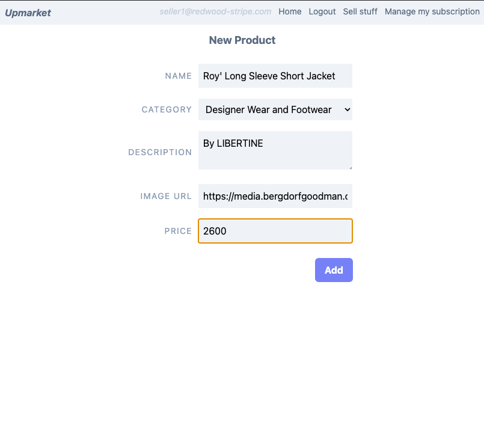
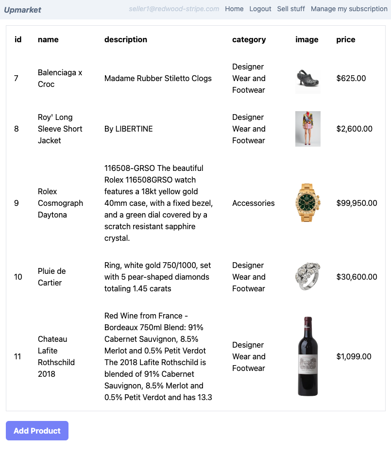
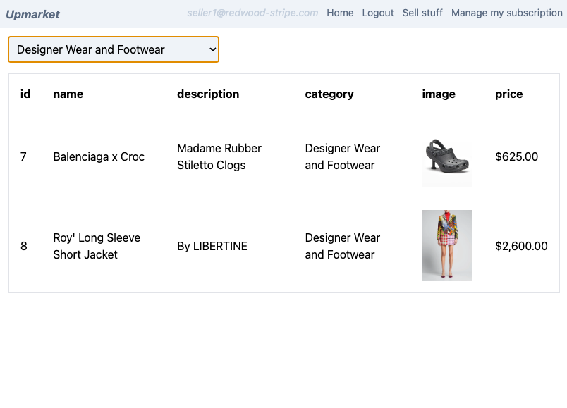

# Part 2: Subscription Management

Welcome to part 2. In part 1, we put together an application that allows users to signup as seller or regular customer. And we made sellers to pick and choose one of the 2 subscription our platform offers. In this part we will create a page for the seller to manage his subscription.

Note that this part has relatively little to do with Stripe, but is necessary to breath some life into our fancy marketplace.

## Create a new manage subscription page

```bash
yarn rw generate page ManageSubscription
```

Let's have 2 options for this basic subscription management:

1. Change Subscription
2. Cancel Subscription

Open `ManageSubscriptionPage.tsx` and put this code in:

```tsx
import { useAuth } from '@redwoodjs/auth'
import { navigate, routes } from '@redwoodjs/router'
import { MetaTags } from '@redwoodjs/web'

const ManageSubscriptionPage = () => {
  const { currentUser } = useAuth()
  const cancelSubscription = async () => {
    // TODO Cancel subscriptions
  }
  return (
    <>
      <MetaTags
        title="Manage My Subscription"
        description="Manage Subscription"
      />
      <div className="w-56 mx-auto">
        <p className="text-slate-500 text-center">
          Current subscription: {currentUser?.subscriptionName}
        </p>
        <ul>
          <li>
            <button
              onClick={() => navigate(routes.pickSubscription())}
              className="py-2 px-4 bg-indigo-400 rounded-md text-white font-bold w-56 mt-5"
            >
              Change subscription
            </button>
          </li>
          <li>
            <button
              onClick={cancelSubscription}
              className="py-2 px-4 bg-indigo-400 rounded-md text-white font-bold w-56 mt-5"
            >
              Cancel subscription
            </button>
          </li>
        </ul>
      </div>
    </>
  )
}

export default ManageSubscriptionPage
```

We now want to add a link to this page in the authenticated part of the `MainLayout.tsx`:

```tsx
...
{isAuthorizedSeller && (
  <>
    <li>
      <Link to={routes.sellStuff()}>Sell stuff</Link>
    </li>
    <li>
      <Link to={routes.manageSubscription()}>
        Manage my subscription
      </Link>
    </li>
  </>
)}
...
```

## Add subscription id in user model

To manage subscription we will need to keep track of the user's subscription id, so let's add it first to our `schema.prisma` file

```prisma
model User {
  id                  Int                 @id @default(autoincrement())
  email               String              @unique
  hashedPassword      String
  salt                String
  roles               String[]
  stripeClientSecret  String?
  resetToken          String?
  resetTokenExpiresAt DateTime?
  subscriptionId      String?
  subscriptionName    String?
  subscriptionStatus  SubscriptionStatus?
  product             Product[]
}
```

In `user.sdl.ts`, you also need to add `subscriptionId: String` to `CreateUserInput` and `UpdateUserInput`

And the create subscription handler in `createSubscription.ts` on the API side also need to be slighty modified to take the `subscriptionId` into account:

```ts
export const handler = async (event: APIGatewayEvent) => {
  logger.info('Invoked createSubscription function')
  if (event.httpMethod !== 'POST') {
    throw new Error('Only post method for this function please')
  }
  const { userId, subscriptionId } = JSON.parse(event.body)
  if (userId && subscriptionId) {
    const user = await getUser(+userId)
    const product = await getSubscription(subscriptionId)
    const customer = await stripe.customers.create({
      name: user.email,
    })
    const priceId = product.default_price as string
    try {
      const { clientSecret, subscriptionId } = await createSubscription(
        customer.id,
        priceId
      )
      await db.user.update({
        where: { id: user.id },
        data: {
          stripeClientSecret: clientSecret,
          subscriptionStatus: 'init',
          subscriptionName: product.name,
          subscriptionId,
        },
      })
      ...
```

Last place to add the subscription id to is `getCurrentUser` in `api/src/lib/auth.ts`:

```ts
export const getCurrentUser = async (session) => {
  return await db.user.findUnique({
    where: { id: session.id },
    select: {
      id: true,
      roles: true,
      email: true,
      subscriptionStatus: true,
      subscriptionName: true,
      subscriptionId: true,
    },
  })
}
```

## Create a new cancel subscription function

Let's create a simple `cancelSubscription` function that reset the user's subscription related properties and deletes the subscription on the stripe side

```
yarn rw g function cancelSubscription
```

`cancelSubscription.ts`'s implementation is the following:

```ts
import type { APIGatewayEvent } from 'aws-lambda'
import { db } from 'src/lib/db'
import { logger } from 'src/lib/logger'
import { stripe } from 'src/lib/stripe'

export const handler = async (event: APIGatewayEvent) => {
  logger.info('Invoked cancelSubscription function')
  if (event.httpMethod !== 'POST') {
    throw new Error('Only post method for this function please')
  }
  const { userId, subscriptionId } = JSON.parse(event.body)
  await db.user.update({
    where: { id: userId },
    data: {
      subscriptionId: null,
      subscriptionName: null,
      subscriptionStatus: null,
    },
  })
  await stripe.subscriptions.del(subscriptionId)
  return {
    statusCode: 201,
    headers: {
      'Content-Type': 'application/json',
    },
    body: JSON.stringify({
      data: 'Subscription deleted',
    }),
  }
}
```

Now on the frontend we can implement the `cancelSubscription` method:

```tsx
const { currentUser, reauthenticate } = useAuth()
const cancelSubscription = async () => {
  if (confirm('Do you really want to cancel your subscriptions?')) {
    const response = await fetch(`${global.RWJS_API_URL}/cancelSubscription`, {
      method: 'POST',
      headers: {
        'Content-Type': 'application/json',
      },
      body: JSON.stringify({
        userId: currentUser.id,
        subscriptionId: currentUser.subscriptionId,
      }),
    })
    if (response.status === 201) {
      await reauthenticate()
      navigate(routes.home())
    }
  }
}
```

## Create product model

Edit your `schema.prisma` and add a product model:

```prisma
model Product {
  id          Int     @id @default(autoincrement())
  price       Float
  name        String
  category    String
  description String?
  imageUrl    String?
  user        User    @relation(fields: [userId], references: [id])
  userId      Int
}
```

Also add products to the user model `products Product[]`
You can now create the corresponding sdl `yarn rw g sdl product`
In the generated `products.sdl.ts` we'll make just one modification, we want to be able to queries a user's products and a category's product. Additionally you might want to add pagination to this endpoint, but that's outside of the scope of this tutorial.
`products(userId: Int, category: String): [Product!]! @requireAuth`
With the following implementation in `api/src/services/product/product.ts`:

```ts
export const products: QueryResolvers['products'] = ({
  userId,
  category,
}: {
  userId?: number
  category?: string
}) => {
  return db.product.findMany({ where: { userId, category } })
}
```

And while you're in this file, the generated service is not handling the one to many relationship with user. So you can replace `createProduct` method with this:

```ts
export const createProduct: MutationResolvers['createProduct'] = ({
  input,
}) => {
  const { userId, ...data } = input
  return db.product.create({
    data: { ...data, user: { connect: { id: userId } } },
  })
}
```

## Add product form

Before writing the form we need to create some categories of stuff to sell. In a real application this would probably be handled with something dynamic like a databse table, but for our purpose a simple hard coded list of categories will suffice.

Under `web/src` create a file `constants.ts` and add:

```ts
export const CATEGORIES = [
  'Designer Wear and Footwear',
  'Accessories',
  'Jewelry',
  'Cosmetics',
  'Fine Wines / Champagne and Spirits',
  'Travel Goods',
]
```

For example... (That being said, if that doesn't already exist, a market place for these luxury items seems like a good idea to me)

We can now add the `CreateProduct` page:

```
yarn rw g page CreateProduct
```

This will be a simple form with name, category, description, price, imageUrl where name, category and price are mandatory fields:

```tsx
import { useAuth } from '@redwoodjs/auth'
import {
  FieldError,
  Form,
  Label,
  NumberField,
  SelectField,
  Submit,
  TextAreaField,
  TextField,
} from '@redwoodjs/forms'
import { navigate, routes } from '@redwoodjs/router'
import { MetaTags, useMutation } from '@redwoodjs/web'
import { CATEGORIES } from 'src/constants'
import { CreateProductInput } from 'types/graphql'

const CREATE_PRODUCT = gql`
  mutation CreateProductMutation($input: CreateProductInput!) {
    createProduct(input: $input) {
      name
      description
      price
    }
  }
`

const CreateProductPage = () => {
  const { currentUser } = useAuth()
  const [create] = useMutation(CREATE_PRODUCT)
  const onSubmit = async (data: CreateProductInput) => {
    await create({ variables: { input: { ...data, userId: currentUser?.id } } })
    navigate(routes.sellStuff())
  }
  return (
    <>
      <MetaTags title="CreateProduct" description="CreateProduct page" />
      <div className="w-96 mx-auto">
        <div className="text-slate-500 font-bold mb-4 text-lg text-center">
          New Product
        </div>
        <Form onSubmit={onSubmit}>
          <table>
            <tbody>
              <tr>
                <td className="text-right uppercase text-sm tracking-widest text-slate-400 w-28">
                  <Label name="name">Name</Label>
                </td>
                <td>
                  <TextField
                    className="bg-slate-100 p-2 m-2 w-64"
                    name="name"
                    validation={{
                      required: {
                        value: true,
                        message: 'Product name is required',
                      },
                    }}
                  />
                  <FieldError name="name" />
                </td>
              </tr>
              <tr>
                <td className="text-right uppercase text-sm tracking-widest text-slate-400 w-28">
                  <Label name="category">Category</Label>
                </td>
                <td>
                  <SelectField
                    className="bg-slate-100 p-2 m-2 w-64"
                    name="category"
                  >
                    {CATEGORIES.map((category) => (
                      <option key={category} value={category}>
                        {category}
                      </option>
                    ))}
                  </SelectField>
                  <FieldError name="category" />
                </td>
              </tr>
              <tr>
                <td className="text-right uppercase text-sm tracking-widest text-slate-400 w-28">
                  <Label name="description">Description</Label>
                </td>
                <td>
                  <TextAreaField
                    className="bg-slate-100 p-2 m-2 w-64"
                    name="description"
                  />
                </td>
              </tr>
              <tr>
                <td className="text-right uppercase text-sm tracking-widest text-slate-400 w-28">
                  <Label name="imageUrl">Image URL</Label>
                </td>
                <td>
                  <TextField
                    className="bg-slate-100 p-2 m-2 w-64"
                    name="imageUrl"
                  />
                </td>
              </tr>
              <tr>
                <td className="text-right uppercase text-sm tracking-widest text-slate-400 w-28">
                  <Label name="price">Price</Label>
                </td>
                <td>
                  <NumberField
                    className="bg-slate-100 p-2 m-2 w-64"
                    name="price"
                    validation={{
                      required: {
                        value: true,
                        message: 'Product price is required',
                      },
                    }}
                  />
                  <FieldError name="price" />
                </td>
              </tr>
            </tbody>
          </table>

          <Submit className="mt-4 float-right py-2 px-4 bg-indigo-400 rounded-md text-white font-bold mr-2">
            Add
          </Submit>
        </Form>
      </div>
    </>
  )
}

export default CreateProductPage
```



## List Products

We will use another cell to display the user's product, the same cell will also be used on the home page to display an optional category's product list.

```
yarn rw g cell products
```

And inside `ProductCells.tsx`:

```tsx
import type { ProductsQuery } from 'types/graphql'
import type { CellSuccessProps, CellFailureProps } from '@redwoodjs/web'

export const QUERY = gql`
  query ProductsQuery($userId: Int, $category: String) {
    products(userId: $userId, category: $category) {
      id
      name
      category
      description
      price
      imageUrl
    }
  }
`

export const Loading = () => <div>Loading...</div>

export const Empty = () => <div>Empty</div>

export const Failure = ({ error }: CellFailureProps) => (
  <div style={{ color: 'red' }}>Error: {error.message}</div>
)

export const Success = ({ products }: CellSuccessProps<ProductsQuery>) => {
  return (
    <table className="border">
      <thead className="text-left">
        <tr
          className="text-slate-500 uppercase tracking-widest"
          style={{ fontSize: '11px' }}
        >
          <th className="text-center p-4">id</th>
          <th className="p-4">name</th>
          <th className="p-4">description</th>
          <th className="p-4">category</th>
          <th className="p-4">image</th>
          <th className="p-4">price</th>
        </tr>
      </thead>
      <tbody>
        {products.map((item) => {
          return (
            <tr key={item.id}>
              <td className="p-4">{item.id}</td>
              <td className="p-4">{item.name}</td>
              <td className="p-4">{item.description}</td>
              <td className="p-4">{item.category}</td>
              <td className="p-4">
                {item.imageUrl && (
                  
                )}
              </td>
              <td className="p-4">
                $
                {item.price.toLocaleString(undefined, {
                  minimumFractionDigits: 0,
                })}
              </td>
            </tr>
          )
        })}
      </tbody>
    </table>
  )
}
```



## Updating our sell stuff page

You can now update our `SellStuffPage.tsx` from part 1:

```tsx
import { useAuth } from '@redwoodjs/auth'
import { Link, routes } from '@redwoodjs/router'
import { MetaTags } from '@redwoodjs/web'
import ProductsCell from 'src/components/ProductsCell'

const SellStuffPage = () => {
  const { currentUser } = useAuth()
  return (
    <>
      <MetaTags title="Sell Stuff" description="Sell Stuff page" />

      {currentUser && <ProductsCell userId={currentUser.id} />}
      <Link
        to={routes.createProduct()}
        className="py-2 px-4 bg-indigo-400 rounded-md text-white font-bold mt-5 inline-block"
      >
        Add Product
      </Link>
    </>
  )
}

export default SellStuffPage
```

## Updating home page

Last but not least we can finally have a homepage listing the product of our marketplace by category

```tsx
import { Form, SelectField } from '@redwoodjs/forms'
import { MetaTags } from '@redwoodjs/web'
import { ChangeEvent, useState } from 'react'
import ProductsCell from 'src/components/ProductsCell'
import { CATEGORIES } from 'src/constants'

const HomePage = () => {
  const [category, setCategory] = useState('')
  const onChangeCategory = (ev: ChangeEvent<HTMLSelectElement>) => {
    setCategory(ev.target.value)
  }
  return (
    <>
      <MetaTags title="Home" description="Home page" />

      <Form>
        <SelectField
          name="category"
          onChange={onChangeCategory}
          className="mb-4 bg-slate-100 p-2"
        >
          <option value="">No filters</option>
          {CATEGORIES.map((category) => (
            <option key={category} value={category}>
              {category}
            </option>
          ))}
        </SelectField>
      </Form>
      <ProductsCell category={category || undefined} />
    </>
  )
}

export default HomePage
```



# End of part 2

In this part we mainly solidified our knowledge of basic Redwood concepts and generator, using functions, services, cells and mutations to create and list products for our marketplace. You can look up the github repository for [this part](https://github.com/generalui/redwood-stripe/tree/main/part2)

In the next [part](../part3/readme.md) we will dive a little bit more into the Stripe API in order to buy the products that you've just created.
