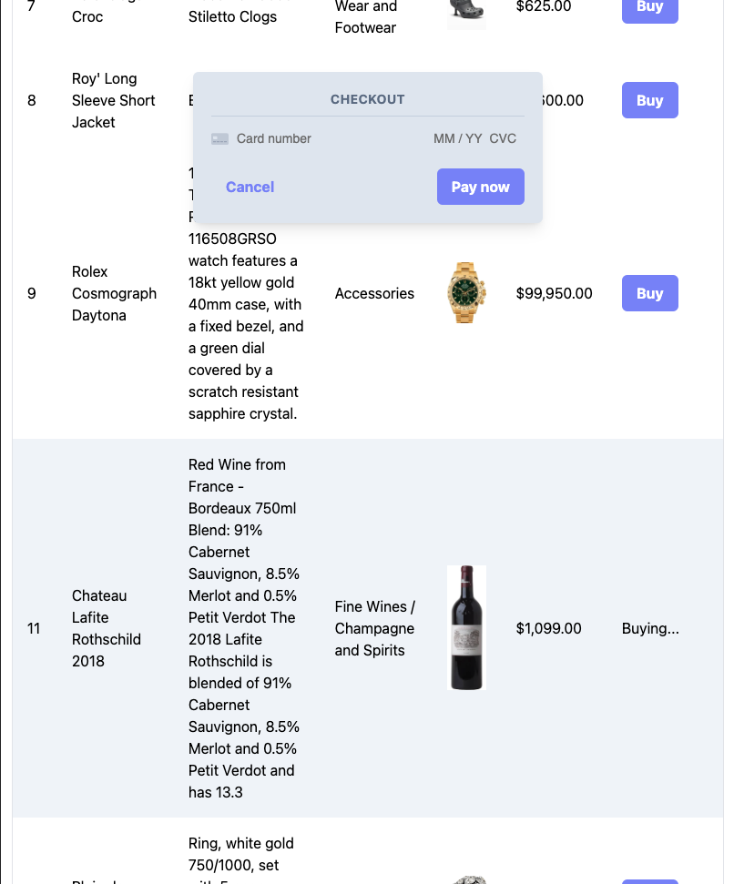
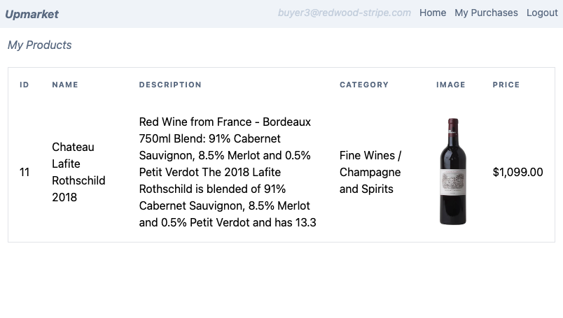

# Part 3: Buying products

In this part we will see how a visitor of our marketplace can use stripe to perform a transaction and buy a product. We will also create a space were the buyer can see a list of the products he purchased.

## Fix homepage

Right now, there is an error on the homepage if you're logged out. It's ok for this demo to not show products to logged out users but it should not show an error. Let's test if the current user exists in `Homepage.tsx` and display message if it doesn't:

```tsx
const HomePage = () => {
  const { currentUser } = useAuth()
  const [category, setCategory] = useState('')
  const onChangeCategory = (ev: ChangeEvent<HTMLSelectElement>) => {
    setCategory(ev.target.value)
  }
  return (
    <>
      <MetaTags title="Home" description="Home page" />
      {currentUser ? (
        <>
          <Form>
            <SelectField
              name="category"
              onChange={onChangeCategory}
              className="mb-4 bg-slate-100 p-2"
            >
              <option value="">No filters</option>
              {CATEGORIES.map((category) => (
                <option key={category} value={category}>
                  {category}
                </option>
              ))}
            </SelectField>
          </Form>
          <ProductsCell category={category || undefined} />
        </>
      ) : (
        <div className="text-xl my-10 text-slate-400 text-center">Welcome!</div>
      )}
    </>
  )
}
```

## Add a purchase model

To keep track of purchases we need to create a new table

```tsx
enum PaymentStatus {
  init
  success
  failed
}

model Purchase {
  id           Int     @id @default(autoincrement())
  user         User    @relation(fields: [userId], references: [id])
  userId       Int
  product      Product @relation(fields: [productId], references: [id])
  productId    Int
  clientSecret String?
  status       PaymentStatus
}
```

A purchase links a product and a user. We add a `status` to the table in order to keep track of the purchase while the transaction is in progress, and a `clientSecret` field that stripe generates at the begining of the process and uses in the webhook to tell us if the purchase was completed or failed. Same mecanism as for subscriptions (see [part1](../part1/readme.md))

Note that we renamed the `SubscriptionStatus` enum to `PaymentStatus` to make it more generic.

Additionally we need to declare those one to many relationship between purchase and user and purchase and product on the other side with `purchases Purchase[]`

Finally we want to keep track of the user on the stripe side, so we add a `stripeCustomerId String?` on the user model referring to the customer id from stripe

we can now create and apply the migration for this db change:

```
yarn rw prisma migrate dev
```

## Create payment intent function

We could add the `createPaymentIntent` mutation in a `paymentIntent.sdl.ts` and create the corresponding service, but just to do something different we will create a `createPaymentIntent` serverless function and use `stripe.paymentIntents.create` (according to the [doc](https://stripe.com/docs/payments/quickstart)) to allow users to buy a product from a seller.

```
yarn rw g function createPaymentIntent
```

Here is the code for the function, we'll go through it step by step after

```tsx
import type { APIGatewayEvent } from 'aws-lambda'
import { db } from 'src/lib/db'
import { logger } from 'src/lib/logger'
import { stripe } from 'src/lib/stripe'
import { User, Product } from '@prisma/client'

export const handler = async (event: APIGatewayEvent) => {
  logger.info('Invoked createSubscription function')
  if (event.httpMethod !== 'POST') {
    throw new Error('Only post method for this function please')
  }
  const { userId, productId } = JSON.parse(event.body)
  if (userId && productId) {
    const user = await getUser(+userId)
    const product = await getProduct(+productId)
    try {
      const paymentIntent = await stripe.paymentIntents.create({
        amount: product.price * 100,
        currency: 'usd',
        customer: user.stripeCustomerId,
        automatic_payment_methods: {
          enabled: true,
        },
      })
      const clientSecret = paymentIntent.client_secret
      await db.purchase.create({
        data: {
          userId,
          productId,
          clientSecret,
          status: 'init',
        },
      })
      return {
        statusCode: 200,
        headers: {
          'Content-Type': 'application/json',
        },
        body: JSON.stringify({
          clientSecret,
        }),
      }
    } catch (error) {
      return {
        statusCode: 400,
        headers: {
          'Content-Type': 'application/json',
        },
        body: JSON.stringify({ message: error.message }),
      }
    }
  }
  return {
    statusCode: 200,
    headers: {
      'Content-Type': 'application/json',
    },
    body: JSON.stringify({
      data: 'nothing happened...',
    }),
  }
}

async function getUser(userId: number): Promise<User> {
  const user = await db.user.findUnique({ where: { id: userId } })
  if (!user) {
    throw new Error(`No users found with id=${userId}`)
  }
  if (!user.stripeCustomerId) {
    const customer = await stripe.customers.create({
      name: user.email,
    })
    await db.user.update({
      where: { id: userId },
      data: { stripeCustomerId: customer.id },
    })
    return { ...user, stripeCustomerId: customer.id }
  }
  return user
}

async function getProduct(productId: number): Promise<Product> {
  const product = await db.product.findUnique({ where: { id: productId } })
  if (!product) {
    throw new Error(`No products found with id=${productId}`)
  }
  return product
}
```

This function expect a `userId` and a `productId` in the body. Once we parsed the body we try to recover those object in the `getUser` and `getProduct` methods. But `getUser` is doing something more. It checks whether the user in the db already has a `stripeCustomerId` or not. If it does we're golden, otherwise we have to ask Stripe for a customer id linked to the user's email and we save it in our db and return it together with the user.

Then we call `stripe.paymentIntents.create` with the customer and amount to retrieve a `clientSecret` that we then save on a `Purchase` object in the db linking the product, the user and the transaction via this `clientSecret`

We then return the `clientSecret` to allow the front-end to complete the transaction.

We can test this function (assuming you have at least 1 user and 1 product in your db)

```
curl --location --request POST 'http://localhost:8910/.redwood/functions/createPaymentIntent' \
--header 'Content-Type: application/json' \
--data-raw '{"productId": 1, "userId": 1}'
```

## Checkout

Let's add a column to the product list on the homepage to add a buy button. For that go to `ProductsCell.tsx` and add this column to the table that we created in [part 2](../part2/readme.md)

```tsx
<td className="p-4">
  <button
    className="py-2 px-4 bg-indigo-400 rounded-md text-white font-bold"
    onClick={() => buy(item.id)}
  >
    Buy
  </button>
</td>
```

Now let's implement the buy function. It will be very similar to the `createSubscription` from [part 1](../part1/readme.md):

```tsx
const { currentUser } = useAuth()
const [clientSecret, setClientSecret] = useState('')
const [purchaseId, setPurchaseId] = useState<number | undefined>()
const [productId, setProductId] = useState<number | undefined>()
const buy = async (productId: number) => {
  setProductId(productId)
  const response = await fetch(`${global.RWJS_API_URL}/createPaymentIntent`, {
    method: 'POST',
    headers: {
      'Content-Type': 'application/json',
    },
    body: JSON.stringify({
      userId: currentUser.id,
      productId,
    }),
  })
  const { clientSecret, purchaseId } = await response.json()
  setClientSecret(clientSecret)
  setPurchaseId(purchaseId)
}
```

We also need a new component (similar to the `Subscribe` component from [part 1](../part1/readme.md))

```
yarn rw g component Checkout
```

Here is the code to begin with

```tsx
import { useAuth } from '@redwoodjs/auth'
import { useLazyQuery } from '@apollo/client'
import { CardElement, useElements, useStripe } from '@stripe/react-stripe-js'
import { useEffect, useState } from 'react'
import { navigate, routes } from '@redwoodjs/router'

const PURCHASE_STATUS_QUERY = gql`
  query PurchasesStatusQuery($purchaseId: Int!) {
    purchase(id: $purchaseId) {
      status
    }
  }
`

const Checkout = ({
  clientSecret,
  purchaseId,
  onClose,
}: {
  clientSecret: string
  purchaseId: number
  onClose: () => void
}) => {
  const { currentUser } = useAuth()
  const [message, setMessage] = useState('')
  const stripe = useStripe()
  const elements = useElements()
  const [getPurchaseStatus, { loading, error, data }] = useLazyQuery(
    PURCHASE_STATUS_QUERY
  )

  const handleSubmit = async (ev: React.FormEvent<HTMLFormElement>) => {
    ev.preventDefault()
    setMessage('Submitting payment...')
    const cardElement = elements.getElement(CardElement)
    const { error, paymentIntent } = await stripe.confirmCardPayment(
      clientSecret,
      {
        payment_method: {
          card: cardElement,
          billing_details: {
            name: currentUser.email,
          },
        },
      }
    )
    if (error) {
      setMessage(error.message)
      return
    }
    if (paymentIntent.status === 'succeeded') {
      setMessage('Waiting for confirmation...')
      checkForConfirmation()
    }
  }

  const checkForConfirmation = () => {
    getPurchaseStatus({ variables: { purchaseId } })
  }

  useEffect(() => {
    if (data?.purchase.status === 'success') {
      navigate(routes.myPurchases())
      return
    }
    if (data?.purchase.status !== 'failed') {
      setTimeout(checkForConfirmation, 2000)
    }
    // eslint-disable-next-line react-hooks/exhaustive-deps
  }, [data])

  return (
    <div className="fixed left-1/2 top-20 -ml-48 p-5 w-96 shadow-lg rounded-md bg-slate-200 text-slate-500">
      <div className="font-bold text-sm uppercase tracking-wide mb-4 pb-2 text-center border-b border-slate-300">
        Checkout
      </div>
      <form onSubmit={handleSubmit}>
        <CardElement />
        <div className="text-slate-400 my-2 italic">
          {loading
            ? 'checking status'
            : error
            ? 'Oops something happened'
            : message}
        </div>
        <div className="overflow-hidden">
          <button
            className="mt-4 float-left py-2 px-4 text-indigo-400 rounded-md font-bold"
            onClick={onClose}
          >
            Cancel
          </button>
          <button
            type="submit"
            className="mt-4 float-right py-2 px-4 bg-indigo-400 rounded-md text-white font-bold"
          >
            Pay now
          </button>
        </div>
      </form>
    </div>
  )
}

export default Checkout
```

In this component, we are using stripe `CardElement` component to collect credit card information and we submit the information to stripe directly.

Stripe will inform our backend (through webhooks) to tell us if the payment is confirmed. The frontend will need to wait for that confirmation. Hence the `checkForConfirmation` method that we'll implement later

Now add the component to `ProductsCell.tsx`

```tsx
<>
  <table className="border">
    <thead className="text-left">
      <tr
        className="text-slate-500 uppercase tracking-widest"
        style={{ fontSize: '11px' }}
      >
        <th className="text-center p-4">id</th>
        <th className="p-4">name</th>
        <th className="p-4">description</th>
        <th className="p-4">category</th>
        <th className="p-4">image</th>
        <th className="p-4">price</th>
        {!userId && (
          <>
            <th className="p-4"></th>
            <th className="p-4"></th>
          </>
        )}
      </tr>
    </thead>
    <tbody>
      {products.map((item) => {
        return (
          <tr
            key={item.id}
            className={productId === item.id ? 'bg-slate-100' : ''}
          >
            <td className="p-4">{item.id}</td>
            <td className="p-4">{item.name}</td>
            <td className="p-4">{item.description}</td>
            <td className="p-4">{item.category}</td>
            <td className="p-4">
              {item.imageUrl && (
                
              )}
            </td>
            <td className="p-4">
              $
              {item.price.toLocaleString(undefined, {
                minimumFractionDigits: 0,
              })}
            </td>
            {!userId && (
              <>
                <td className="p-4">
                  {productId === item.id ? (
                    'Buying...'
                  ) : (
                    <button
                      className="py-2 px-4 bg-indigo-400 rounded-md text-white font-bold"
                      onClick={() => buy(item.id)}
                    >
                      Buy
                    </button>
                  )}
                </td>
              </>
            )}
          </tr>
        )
      })}
    </tbody>
  </table>
  {clientSecret && (
    <Checkout
      clientSecret={clientSecret}
      purchaseId={purchaseId}
      onClose={() => {
        setClientSecret(null)
        setProductId(null)
      }}
    />
  )}
</>
```

## Register confirmation webhook

This is an update of the existing `stripeWebhook` function that we wrote in [part 1](../part1/readme.md))

```tsx
export const handler = async (event: APIGatewayEvent) => {
  logger.info('Invoked stripeWebhook function')
  const stripeEvent = JSON.parse(event.body)
  const status: PaymentStatus | null =
    stripeEvent.type === 'payment_intent.succeeded'
      ? 'success'
      : stripeEvent.type === 'payment_intent.payment_failed'
      ? 'failed'
      : null
  if (status) {
    const paymentIntent = stripeEvent.data.object
    const clientSecret = paymentIntent.client_secret
    if (await isSubscriptionClientSecret(clientSecret)) {
      await db.user.updateMany({
        where: { stripeClientSecret: clientSecret },
        data: {
          stripeClientSecret: null,
          subscriptionStatus: status,
        },
      })
    } else {
      await db.purchase.updateMany({
        where: { clientSecret },
        data: { clientSecret: null, status: 'success' },
      })
    }
  }

  return {
    statusCode: 200,
    headers: {
      'Content-Type': 'application/json',
    },
    body: JSON.stringify({
      data: { received: true },
    }),
  }
}

async function isSubscriptionClientSecret(clientSecret: string) {
  return !!(await db.user.count({
    where: { stripeClientSecret: clientSecret },
  }))
}
```

The main different is the `if isSubscriptionClientSecret` statement where in the else cause we know that it's not a subcription and we can update the purchase with the corresponding `clientSecret` to the `success` status



## Generate purchases sdl

We could create a function to retrieve the purchase by id, but I think that would be an error, it seems more fitting to create a sdl as the `purchase` object apparents itself to a REST resource that can be queried itself or through its relationship to users and products.

```
yarn rw g sdl purchases
```

## Create my products page

First we want to be able to query a user's purchases. In `purchases.sdl.ts`:

```graphql
type Query {
  purchases(userId: Int): [Purchase!]! @requireAuth
  purchase(id: Int!): Purchase @requireAuth
}
```

And now we can check for this `userId` in `servcies/purchases/purchases.ts`:

```ts
export const purchases: QueryResolvers['purchases'] = ({
  userId,
}: {
  userId?: number
}) => {
  if (userId) {
    return db.purchase.findMany({ where: { userId } })
  }
  return db.purchase.findMany()
}
```

```
yarn rw g page MyPurchases
yarn rw g cell MyPurchases
```

We will list purchases from the current user in this page
Add the page in the right section of our `Routes.tsx`:

```tsx
<Private unauthenticated="home">
  <Route
    path="/pick-subscription"
    page={PickSubscriptionPage}
    name="pickSubscription"
  />
  <Route path="/sell-stuff" page={SellStuffPage} name="sellStuff" />
  <Route
    path="/manage-subscription"
    page={ManageSubscriptionPage}
    name="manageSubscription"
  />
  <Route path="/create-product" page={CreateProductPage} name="createProduct" />
  <Route path="/my-purchases" page={MyPurchasesPage} name="myPurchases" />
</Private>
```

`MyPurchasesPage.tsx` is just a wrapper for `MyPurchasesCell.tsx`

```tsx
import { useAuth } from '@redwoodjs/auth'
import { MetaTags } from '@redwoodjs/web'
import MyPurchasesCell from 'src/components/MyPurchasesCell'

const MyPurchasesPage = () => {
  const { currentUser } = useAuth()
  return (
    <>
      <MetaTags title="My purchases" description="My purchases" />
      <h1 className="text-slate-500 mb-5 italic">My Products</h1>
      {currentUser ? (
        <>
          <MyPurchasesCell userId={currentUser.id} />
        </>
      ) : (
        'Login/Signup to access your purchases'
      )}
    </>
  )
}

export default MyPurchasesPage
```

And `MyPurchasesCell` ressembles `ProductsCell`:

```tsx
import type { CellSuccessProps, CellFailureProps } from '@redwoodjs/web'

type MyPurchase = {
  product: {
    id: number
    name: string
    category: string
    description?: string
    imageUrl?: string
    price: number
  }
}

type MyPurchases = {
  purchases: MyPurchase[]
}

export const QUERY = gql`
  query PurchasessQuery($userId: Int) {
    purchases(userId: $userId) {
      product {
        id
        name
        description
        imageUrl
        category
        price
      }
    }
  }
`

export const Loading = () => <div>Loading...</div>

export const Empty = () => <div>Empty</div>

export const Failure = ({ error }: CellFailureProps) => (
  <div style={{ color: 'red' }}>Error: {error.message}</div>
)

export const Success = ({ purchases }: CellSuccessProps<MyPurchases>) => {
  return (
    <table className="border">
      <thead className="text-left">
        <tr
          className="text-slate-500 uppercase tracking-widest"
          style={{ fontSize: '11px' }}
        >
          <th className="text-center p-4">id</th>
          <th className="p-4">name</th>
          <th className="p-4">description</th>
          <th className="p-4">category</th>
          <th className="p-4">image</th>
          <th className="p-4">price</th>
        </tr>
      </thead>
      <tbody>
        {purchases.map(({ product }) => {
          return (
            <tr key={product.id}>
              <td className="p-4">{product.id}</td>
              <td className="p-4">{product.name}</td>
              <td className="p-4">{product.description}</td>
              <td className="p-4">{product.category}</td>
              <td className="p-4">
                {product.imageUrl && (
                  
                )}
              </td>
              <td className="p-4">
                $
                {product.price.toLocaleString(undefined, {
                  minimumFractionDigits: 0,
                })}
              </td>
            </tr>
          )
        })}
      </tbody>
    </table>
  )
}
```

Aditionally, we can add a menu entry to access this page directly from the menu by editing our `MainLayout.tsx`:

```tsx
...
    {isAuthenticated ? (
      <>
        <li>
          <Link to={routes.myPurchases()}>My Purchases</Link>
        </li>
        <li>
          <button onClick={logOut}>Logout</button>
        </li>
      </>
    ) : (
...
```



## implement checkForConfirmation

We're now ready to get to the implementation of the `checkForConfirmation` method that will poll the `Purchase` table through the `purchase(id: Int!)` graphql Query.

Here is the query to be added to `Checkout.tsx`

```tsx
export const PURCHASE_STATUS_QUERY = gql`
  query PurchasesStatusQuery($purchaseId: Int!) {
    purchase(id: $purchaseId) {
      status
    }
  }
`
```

Since we're going to be polling that endpoint we'll use `useLazyQuery` instead of `useQuery`:

```tsx
import { useLazyQuery } from '@apollo/client'
...
const [getPurchaseStatus, { loading, error, data }] = useLazyQuery(
  PURCHASE_STATUS_QUERY
)
```

We can now use this query in `checkForConfirmation`:

```tsx
const checkForConfirmation = () => {
  getPurchaseStatus({ variables: { purchaseId } })
}

useEffect(() => {
  if (data?.purchase.status === 'success') {
    navigate(routes.myPurchases())
    return
  }
  if (data?.purchase.status !== 'failed') {
    setTimeout(checkForConfirmation, 2000)
  }
  // eslint-disable-next-line react-hooks/exhaustive-deps
}, [data])
```


## Signal when a product is owned

One limitation of our market place for luxury goods is that one item can be bought many times, which would make sense if we sold candies, but makes less sense if the product is a yacht or an island... As an exercise you can try to take this limitation into account and only display items that have not been bought yet.

For now we'll just add an optional `owned` attribute to our `Product` graphql type. Update `product.sdl.ts` with:

```graphql
type Product {
  id: Int!
  price: Float!
  name: String!
  category: String!
  description: String
  imageUrl: String
  user: User!
  userId: Int!
  owned: Boolean
}
```

And in the service `services/products/products.ts` add `owned` to the resolver:

```ts
export const Product: ProductResolvers = {
  user: (_obj, { root }) =>
    db.product.findUnique({ where: { id: root.id } }).user(),
  owned: async (_obj, { root }) => {
    const count = await db.purchase.count({
      where: {
        userId: context.currentUser?.id,
        productId: root.id,
        status: 'success',
      },
    })
    return count > 0
  },
}
```

This should now be available in the frontend and more precisely in our `ProductsCell.tsx`

```tsx
export const QUERY = gql`
  query ProductsQuery($userId: Int, $category: String) {
    products(userId: $userId, category: $category) {
      id
      name
      category
      description
      price
      imageUrl
      owned
    }
  }
`
```

If `owned` is still not recognized by intellisense, run `yarn rw g types` and, if needed, reload the editor. I have noticed that I often have to reload VS Code in these kind of situations

Lastly, we can add a column to our product table to tell if the product is owned by the current user or not:

```tsx
<td className="p-4">
  {item.owned && (
    <span className="font-bold italic text-slate-400">You own it</span>
  )}
</td>
```

# End of part 3

In this part we reused a lot of what we learned in part 1 to pay for products on our marketplace. You can look up the github repository for [this part](https://github.com/generalui/redwood-stripe/tree/main/part3)

In the next [part](../part4/readme.md) we will use Stripe Connect to handle payouts to the sellers.
